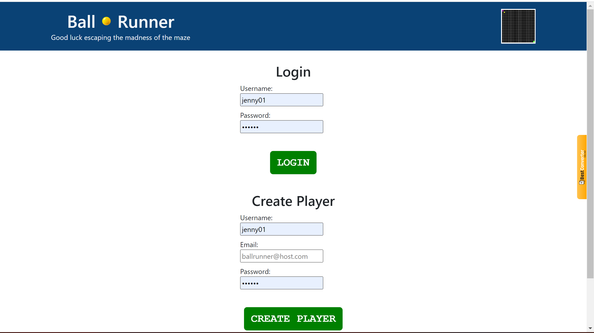
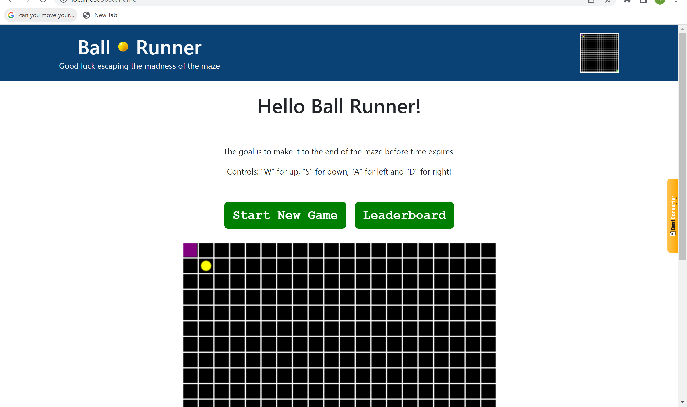
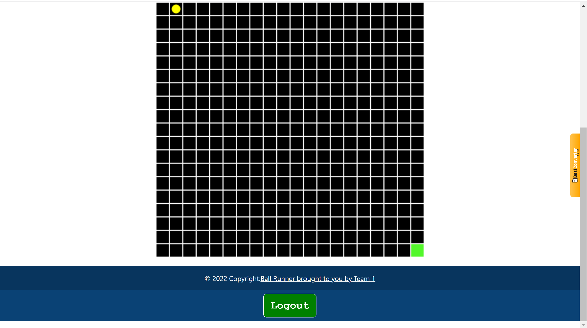
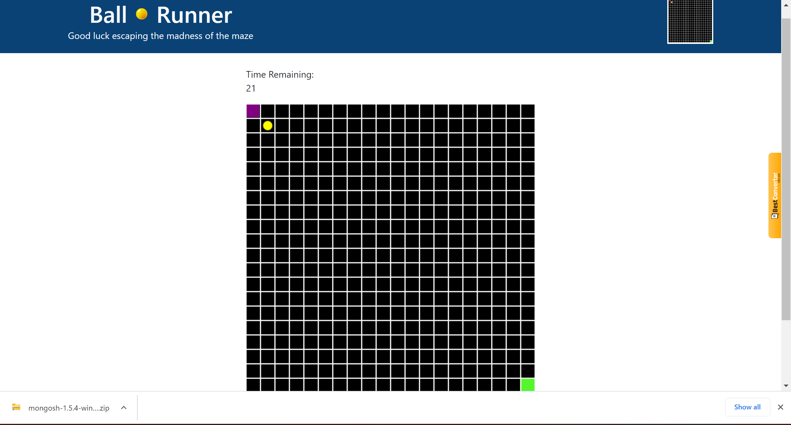
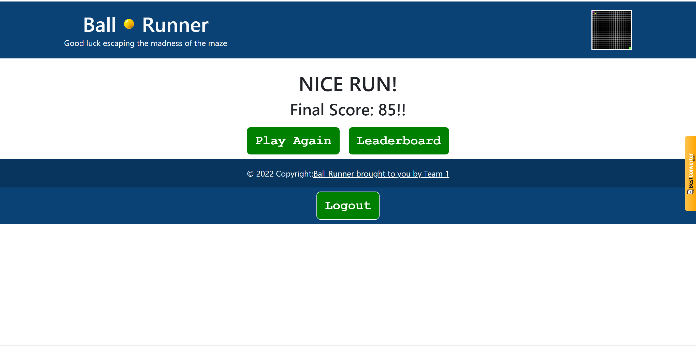
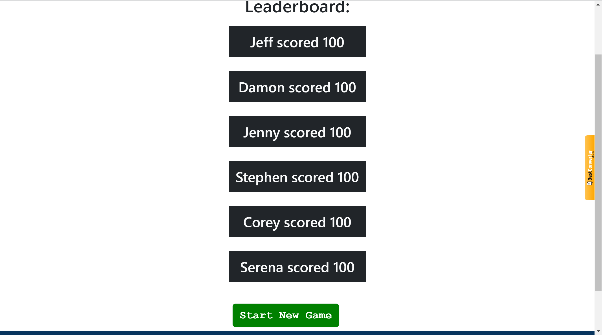
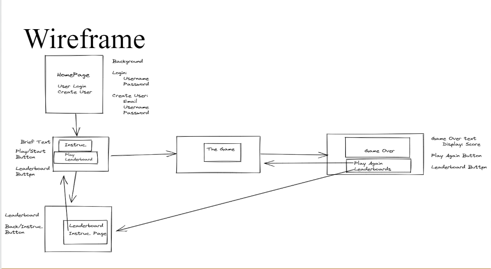

# InteractiveMERNProject

## Project title: Ball runner

## Project Description
Created a little maze game where you have to get rid of all the lines in the grid. 
This is a full-stack MERN App where we created a maze game where you have to get rid of all the lines in the grid.
## Application Link: 

Heroku: https://ballrunner.herokuapp.com/

## User Story

As game player I want an application where you can login or create a user to be able to play an interactive game. As a user yoou have to be able to finish the maze before the timer ends.

## Acceptance Criteria

When I load the login page
Then I am presented with the game's title, and options to login or create a username

When I click the create username button,
Then I am prompted to enter my email address, desired username, and my password, and I am brought back to the login page

When I click the log in button,
Then I see instructions displayed, along with options to start game or view leaderboard

When I click on the view leaderboard button, 
Then I see the top 5 all-time high scores by username

When I click start the game button, 
Then the game initializes

When I click the Quit game button,
Then I am directed to the Game Over page

When game ends,
Then I am presented with Game Over screen

When viewing the Game Over screen,
Then I see my most recent score, and have options to see Leaderboard or Start Game again

## Technologies Used 

* React for the front end.

* GraphQL with a Node.js and Express.js server.

* MongoDB and the Mongoose ODM for the database.

* Queries and mutations for retrieving, adding, updating, and deleting data.

* Includes authentication (JWT).

* Protected sensitive API key information on the server.

### CSS Styling

* React Bootstrap 

## Project Screenshots

1. Login/Create User Page:

  

2. Home page top of the page

3. Home page bottom of the page

4. Game page

5. End of the game

6. LeaderBoard

## Project Wireframe
